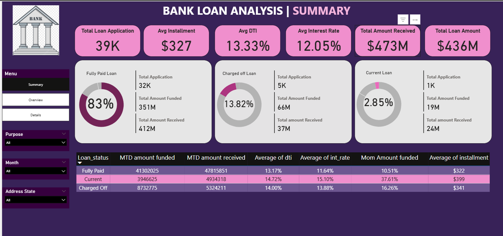

# 🏦 Lending Risk & Default Pattern Analysis by Swasthik BS

The **Lending Risk & Default Pattern Analysis** focuses on identifying factors that influence **loan repayment and defaults**, helping financial institutions enhance decision-making in loan approvals and risk management.  

## 📌 Overview  
- Analyze borrower demographics, credit history, and repayment patterns.  
- Visualize loan approval statistics, repayment success, and default risk.  
- Support data-driven improvements in lending strategies.  

## 📈 Key Insights  
- **Borrower Behavior** → Strong correlation between employment length, credit history, and repayment success.  
- **Risk Factors** → High debt-to-income ratios and frequent past delinquencies predict higher loan default.  
- **Verification Status** → Verified borrowers showed better repayment trends.  
- **Home Ownership** → Loan repayment varied significantly with home ownership type.  

## 📊 Dashboard KPIs & Analysis  
✔ Year-wise loan amount analysis  
✔ Grade & sub-grade wise revolving balance (revol_bal)  
✔ Total payment vs. verification status  
✔ Loan status breakdown by year & month  
✔ Last payment date statistics by home ownership  

## 🚀 Recommendations  
- **Risk Assessment** → Incorporate identified risk factors into loan approval workflows.  
- **Monitoring** → Enhance tracking of high-risk borrowers to prevent defaults.  
- **Data Utilization** → Continuously refine lending policies using ongoing analytics.  

## 🛠️ Tech Stack  
- **Power BI** → Data Visualization  
- **Excel** → Data Cleaning & Preprocessing  
- **SQL (Finance_Query.sql)** → Data Extraction & Analysis  
- **CSV/XLSX** → Data Sources  

## 📸 Dashboard Previews  

### 📊 Loan Dashboard  
  
 
## 📂 Repository Contents  
- `Bank Loan Analysis.pbix` → Power BI dashboard  
- `Finance_1.csv` & `Finance_2.xlsx` → Datasets  
- `Finance_Query.sql` → SQL queries for loan analysis  
- `README.md` → Documentation  
- Dashboard screenshots (`bank-dashboard.png`, `Excel Bank loan.png`)  

## 📬 Contact
For queries or collaboration, feel free to connect via [LinkedIn](https://www.linkedin.com/in/swasthik-bs).

